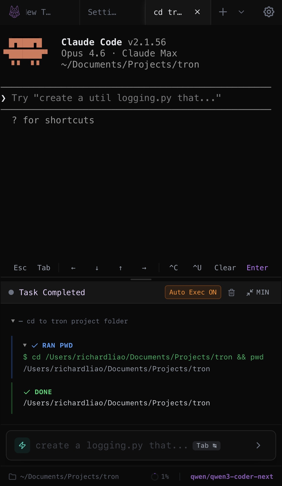
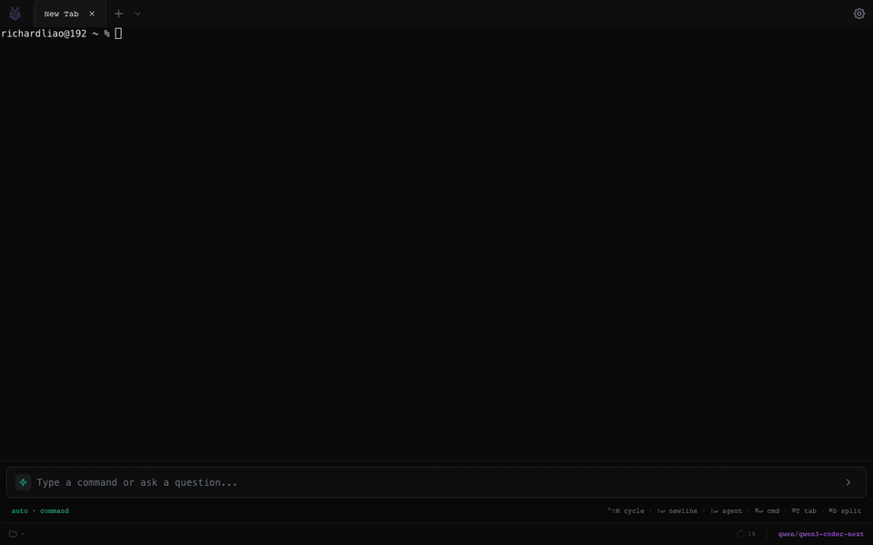
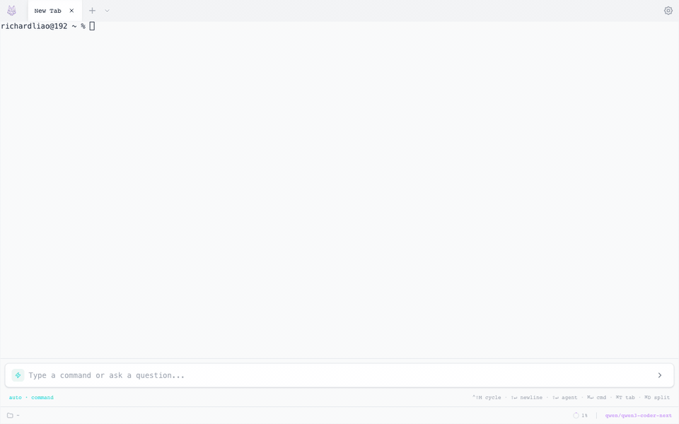

 <h1 align="center">Tron — Vibe Code Anywhere</h1>


<h3 align="center">Open-source AI terminal with a built-in web server.<br/>Open the app, and your AI coding environment is instantly available from any browser — phone, tablet, or another machine.</h3>

<p align="center">
  <a href="https://github.com/Shadowhusky/Tron/stargazers"></a>
  <a href="https://github.com/Shadowhusky/Tron/blob/main/LICENSE"></a>
  <a href="https://discord.gg/EeTCS7A6"></a>
  <a href="https://github.com/Shadowhusky/Tron/releases"></a>
</p>

---

<p align="center">
  <em>Vibe code from your phone — sessions persist even if you close the browser</em>
</p>
<p align="center">
  
</p>

## Why Tron?

**Your data never leaves your machine.** Tron runs locally — the AI agent, terminal, and web server all live on your computer. No cloud relay, no third-party servers. Add [Tailscale](https://tailscale.com) for encrypted remote access from anywhere, without exposing a single port.

- **Vibe code everywhere** — built-in web server starts automatically; open any browser on your phone, tablet, or another PC and you're in
- **Sessions never die** — close the browser, reopen it hours later, everything is exactly where you left it: terminal output, agent threads, scroll position
- **AI agent in your real shell** — the agent executes multi-step plans directly in your terminal with live output and permission controls
- **Any model** — Ollama, LM Studio, OpenAI, Anthropic, Gemini, DeepSeek, Kimi, Qwen, GLM, MiniMax, or any compatible API
- **SSH remote** — connect to remote servers; terminal, agent, and all features work identically over SSH
- **Private & secure** — everything runs on your machine, dangerous command detection, permission prompts, loop guards
- **Cross-platform** — macOS, Windows, Linux. Desktop (Electron) or browser

https://github.com/user-attachments/assets/1e71e424-940a-4ff5-be21-5460d6843ab1

## Demo

| Terminal & Split Panes | AI Agent |
|:---:|:---:|
|  |  |

| Agent View | Input Modes |
|:---:|:---:|
|  |  |

| Themes | SSH |
|:---:|:---:|
|  |  |

## Getting Started

**Prerequisites:** Node.js 18+. Optionally [Ollama](https://ollama.ai) for free local AI.

```bash
git clone https://github.com/Shadowhusky/Tron.git
cd tron && npm install

# Desktop app
npm run dev

# Web app (self-hosted)
npm run dev:web
```

On first launch, the setup wizard walks you through theme selection and AI provider configuration.

## Deployment Modes

| Mode | How | Use Case |
|------|-----|----------|
| **Desktop** | `npm run dev` | Local Electron app |
| **Built-in web server** | Settings > Web Server | Access from any browser on your network |
| **Standalone web** | `npm run start:web` | Headless server deployment |
| **Gateway** | `TRON_MODE=gateway npm run start:web` | SSH-only relay for cloud |

The **built-in web server** is the easiest way to access Tron from another device — toggle it on in Settings, and it shows your local IPs and port. For headless servers without a desktop, use the standalone web mode. Gateway mode restricts access to SSH connections only, making it safe for multi-user cloud deployments.

> **Tip:** Local network addresses (e.g. `192.168.x.x`) are not reachable outside your LAN. For easy remote access on mobile, pair the web server with a mesh VPN like [Tailscale](https://tailscale.com) — it assigns a stable IP to each device so you can reach your terminal from anywhere without port forwarding.

### Docker

Run the web server as a persistent Docker service with auto-restart:

```bash
# Quick start
docker compose up -d

# Rebuild after pulling updates
docker compose build && docker compose up -d

# View logs
docker compose logs -f

# Stop
docker compose down
```

The container runs on port **3888** and auto-restarts on crash or system reboot. Configuration is loaded from your `.env` file.

**What's included:**
- Full terminal access inside the container (bash, git, curl, vim)
- Host filesystem mounted at `/host` (read-write)
- Docker socket access for container management
- `host.docker.internal` resolves to the host machine

**Connecting to host AI providers (e.g. LM Studio, Ollama):**

Use `host.docker.internal` instead of `localhost` for the base URL in Settings:
```
http://host.docker.internal:1234   # LM Studio
http://host.docker.internal:11434  # Ollama
```

**Gateway mode** (SSH-only, no local terminal):
```yaml
# In docker-compose.yml, uncomment:
environment:
  - TRON_MODE=gateway
  - TRON_SSH_ONLY=true
```

## Features

### Terminal
- Tabbed interface with split panes (vertical/horizontal, recursive nesting)
- Smart input bar with shell completions, AI ghost text, and command history
- Three themes — Dark, Light, Modern (frosty glass) + system auto-detect
- Persistent history — terminal output survives app restarts

### AI Agent
- Autonomous multi-step execution with live terminal output
- **Agent View** — full-height, chat-focused AI-first interface
- Tools: `execute_command`, `run_in_terminal`, `write_file`, `read_file`, `edit_file`, `send_text`, `read_terminal`
- Permission system with dangerous command detection and double-confirm
- Auto-execute mode, thinking mode, streaming overlay with diff previews
- Context management with usage ring, summarization, and `/log` export

### Input Modes
| Mode | Description |
|------|-------------|
| **Auto** | Detects command vs. natural language |
| **Command** | Direct shell with Tab completion |
| **Advice** | AI suggests a single command with explanation |
| **Agent** | Multi-step autonomous execution |

### SSH
- Password, private key, and SSH agent authentication
- Saved profiles with optional credential persistence
- AI agent works fully over SSH (commands, file ops, system inspection)

### Built-in Web Server
- Toggle on in Settings > Web Server — no separate server process needed
- Shows local IP addresses and configurable port
- Access your full terminal from any browser on the network
- Pair with [Tailscale](https://tailscale.com) for secure remote access

### Session Persistence
- Terminal output survives app restarts — reopen and see your full history
- Save tabs to disk and restore them anytime (right-click tab → Save)
- Use your preferred coding agent (Claude Code, Aider, etc.) inside Tron and resume seamlessly even if the page closes
- Agent threads, overlay state, and scroll position are all preserved

### Providers
Ollama, LM Studio, OpenAI, Anthropic, Gemini, DeepSeek, Kimi, Qwen, GLM, MiniMax, OpenAI Compatible, Anthropic Compatible.

## Keyboard Shortcuts

| Action | macOS | Windows/Linux |
|--------|-------|---------------|
| New tab | `Cmd+T` | `Ctrl+T` |
| Close tab | `Cmd+W` | `Ctrl+W` |
| Split vertical | `Cmd+D` | `Ctrl+D` |
| Split horizontal | `Cmd+Shift+D` | `Ctrl+Shift+D` |
| Settings | `Cmd+,` | `Ctrl+,` |
| Force agent | `Cmd+Enter` | `Ctrl+Enter` |
| Cycle mode | `Ctrl+Shift+M` | `Ctrl+Shift+M` |

All shortcuts are customizable in Settings.

## macOS Gatekeeper Notice

When opening the app for the first time on macOS, you may see a warning that the app is from an unidentified developer. To open it:

**Right-click** the app → **Open** → click **Open** in the dialog.

You only need to do this once — macOS remembers your choice. To build a fully signed app that skips this warning, see the [code signing guide](https://www.electron.build/code-signing).

## Development

```bash
npm run dev              # Electron + Vite dev
npm run dev:web          # Web mode dev
npm run build            # Production build
npm run lint             # ESLint
npm run test:e2e         # Playwright E2E tests
```

## Tech Stack

Electron, React 19, TypeScript, Vite, xterm.js, Tailwind CSS, Framer Motion, TanStack Virtual/Query, ssh2, Playwright.

## Community

- [Discord](https://discord.gg/EeTCS7A6) — questions, feedback, feature requests
- [GitHub Issues](https://github.com/Shadowhusky/Tron/issues) — bug reports

## License

MIT
