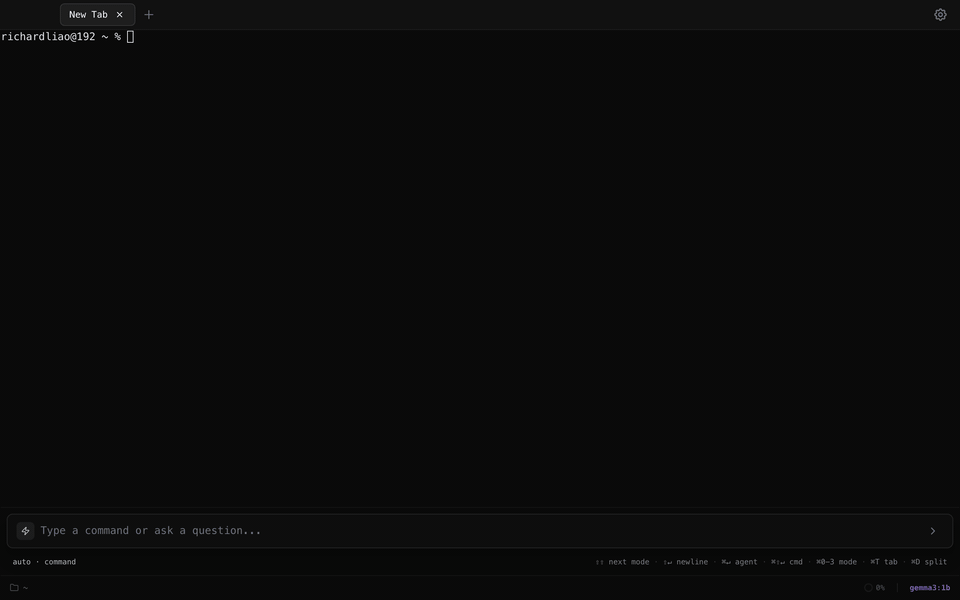
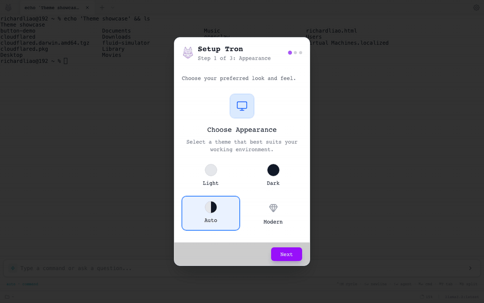
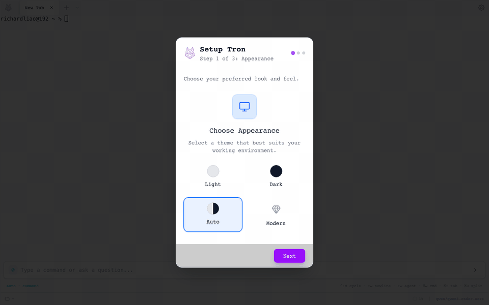
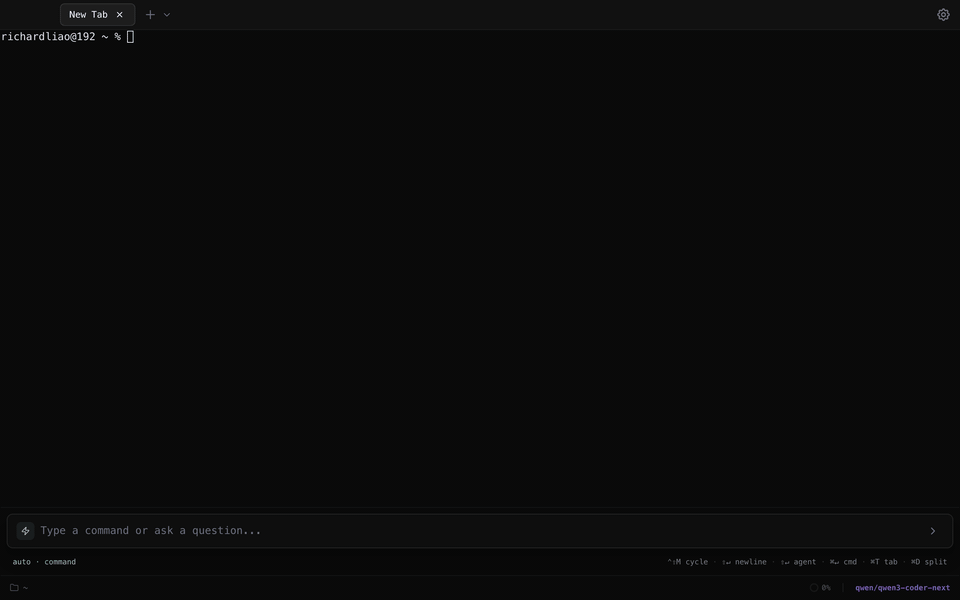
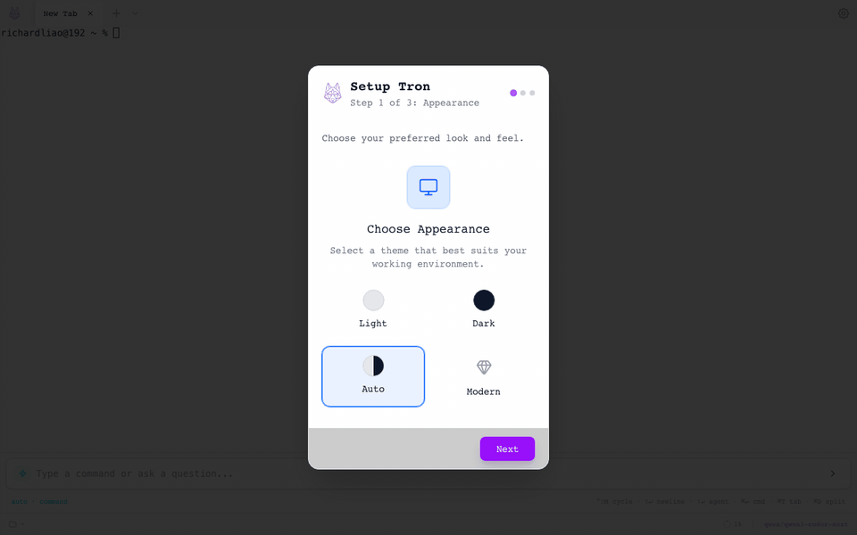
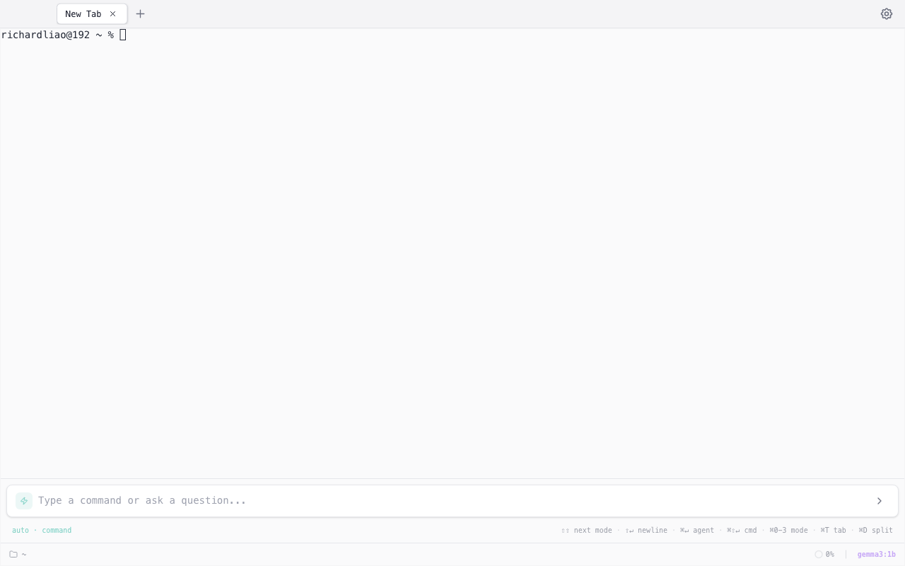
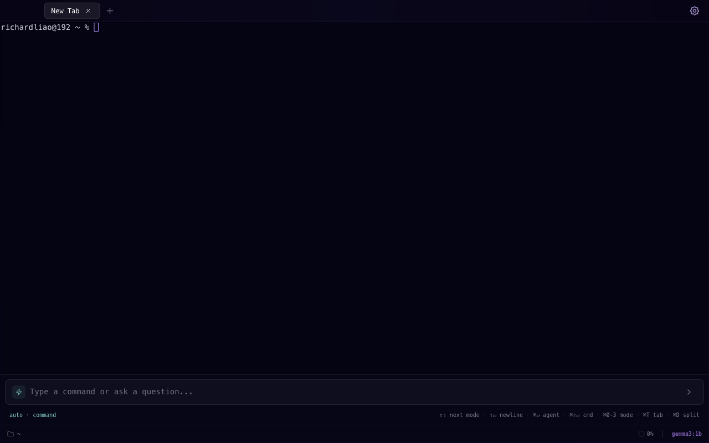
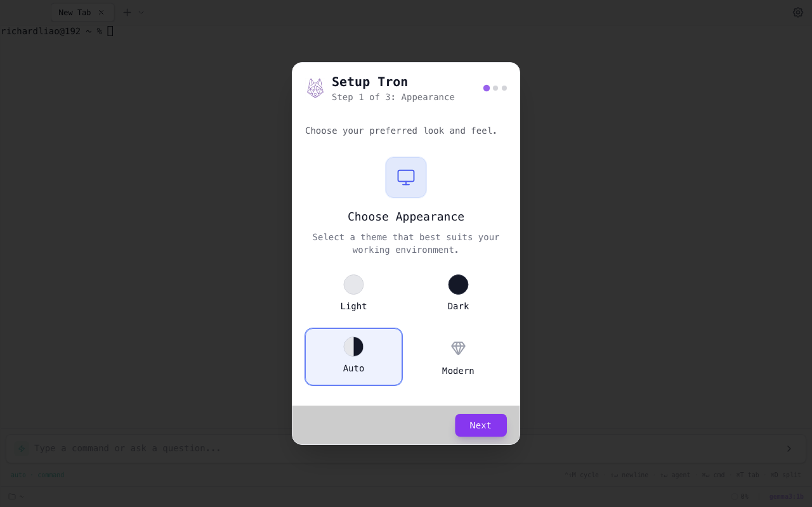
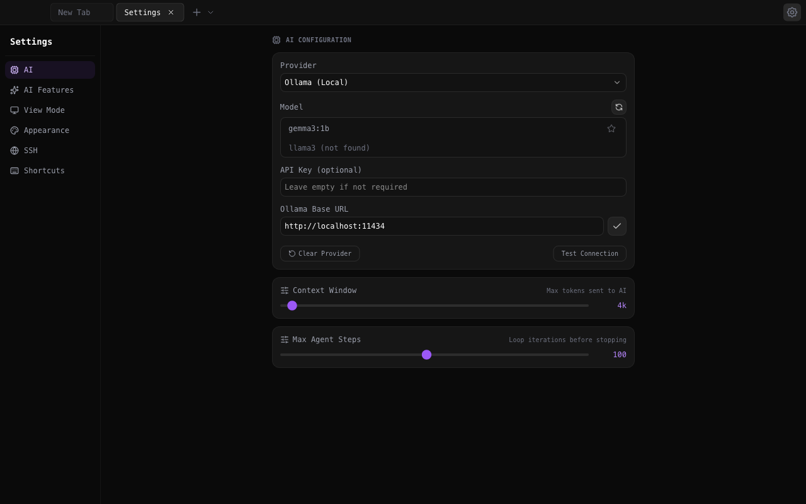

# Tron — AI-Powered Terminal

A modern desktop terminal with a built-in AI agent that can execute commands, write files, and build projects on your behalf. Connect any LLM — local (Ollama, LM Studio) or cloud (OpenAI, Anthropic, Gemini, DeepSeek, and more) — and let the agent handle complex tasks while you watch in real-time.


## Why Tron?

Most AI coding tools are chat-first: you paste context in, copy commands out, run them yourself. Tron flips that. It's a **terminal-first** app where the AI operates directly in your shell — running commands, reading output, writing files, and iterating until the job is done.

- **Real terminal, real shell.** Full PTY with xterm.js. Your aliases, shell config, and tools all work.
- **Agent runs commands for you.** Describe what you want; the agent executes multi-step plans with permission controls.
- **Any model, any provider.** Ollama, LM Studio, OpenAI, Anthropic, Gemini, DeepSeek, Kimi, Qwen, GLM, MiniMax — or any OpenAI/Anthropic-compatible API.
- **Safety built in.** Dangerous command detection, permission prompts, double-confirm for destructive operations, loop detection, and circuit breakers.
- **Cross-platform.** macOS, Windows, and Linux. Native window chrome on each platform.

## Demo

### Terminal — Tabs, Commands & Split Panes



### Theme Switching — Dark, Light & Modern



### Input Modes — Auto, Command, Advice & Agent



### Advice Mode — AI Command Suggestions



### AI Agent — Autonomous Task Execution with Confirmations



### Settings — AI Config, Appearance & Shortcuts


## Screenshots

<table>
<tr>
<td><strong>Dark Theme</strong></td>
<td><strong>Light Theme</strong></td>
<td><strong>Modern Theme</strong></td>
</tr>
<tr>
<td></td>
<td></td>
<td></td>
</tr>
</table>

<table>
<tr>
<td><strong>Setup Wizard</strong></td>
<td><strong>Settings</strong></td>
</tr>
<tr>
<td></td>
<td></td>
</tr>
</table>

## Features

### Terminal

- **Tabbed interface** — open multiple sessions, drag to reorder, rename tabs
- **Split panes** — vertical (`Cmd+D`) and horizontal (`Cmd+Shift+D`) splits, recursive nesting
- **Smart input bar** — replaces the traditional prompt with a unified command/AI input at the bottom of each tab
- **Shell completions** — Tab completion for commands, paths, and history
- **AI ghost text** — idle suggestions appear as inline ghost text after 3 seconds of inactivity
- **Session persistence** — agent state, draft input, and overlay height survive app restarts
- **Three themes** — Dark, Light, Modern (frosty glass), plus system auto-detect

### AI Agent

The agent is an autonomous loop that plans and executes tasks step-by-step:

- **Tool use** — `execute_command`, `run_in_terminal`, `write_file`, `read_file`, `edit_file`, `send_text`, `read_terminal`, `ask_question`
- **Live execution** — commands run in the real terminal with output visible in real-time
- **Permission system** — every command requires explicit approval (Allow Once / Always Allow / Deny)
- **Dangerous command detection** — `rm -rf`, `sudo`, `git push --force`, etc. trigger a red warning with double-confirm
- **Auto-execute mode** — trust the agent to run safe commands automatically (toggle per session)
- **Thinking mode** — view the model's reasoning process in real-time (for models that support it)
- **Streaming overlay** — live progress for file writes, edits, and reads with diff previews
- **Context management** — context ring shows usage, modal for full view, summarization, and manual clearing
- **Loop detection** — detects repeated actions and forces the agent to change approach
- **Session logging** — `/log` command exports the full agent thread to a structured JSON file

### Input Modes

| Mode | Shortcut | Description |
|------|----------|-------------|
| **Auto** | `Cmd+0` | Automatically detects command vs. natural language |
| **Command** | `Cmd+1` | Direct shell commands with Tab completion and history |
| **Advice** | `Cmd+2` | Ask AI for a single command suggestion with explanation |
| **Agent** | `Cmd+3` | Multi-step autonomous task execution |

- **Double-tap Shift** to cycle through modes
- **Cmd+Enter** forces agent mode regardless of current mode
- **Cmd+Shift+Enter** forces command mode
- **Shift+Enter** inserts a newline (multiline input auto-classifies as agent mode)

### Supported Providers

| Provider | Type | Notes |
|----------|------|-------|
| **Ollama** | Local | Free, runs on your machine. Supports tool calling. |
| **LM Studio** | Local | Local inference server with OpenAI-compatible API. |
| **OpenAI** | Cloud | GPT-5.2, GPT-4o, o1, o3-mini, Codex models. |
| **Anthropic** | Cloud | Claude Sonnet, Claude Opus, Claude Haiku. |
| **Gemini** | Cloud | Google's Gemini 3.x and 2.5 Pro/Flash models. |
| **DeepSeek** | Cloud | DeepSeek Chat and Reasoner with thinking support. |
| **Kimi** | Cloud | Moonshot AI's Kimi K2.5 models. |
| **Qwen** | Cloud | Alibaba's Qwen 3.5 models via DashScope. |
| **GLM** | Cloud | Zhipu AI's GLM-5 models. |
| **MiniMax** | Cloud | MiniMax M2.5 models. |
| **OpenAI Compatible** | Custom | Any API following the OpenAI chat/completions spec. |
| **Anthropic Compatible** | Custom | Any API following the Anthropic messages spec. |

### Additional Features

- **Image attachments** — drag-and-drop, paste, or pick images for vision-capable models
- **Smart path quoting** — automatically wraps space-containing paths in quotes
- **Keyboard shortcuts** — fully customizable via Settings > Shortcuts, with hotkey recording
- **Context bar** — shows current directory, model selector, and context usage ring
- **Cross-tab notifications** — background agent completions show toast notifications

## Getting Started

### Prerequisites

- **Node.js** 18+ and npm
- **Ollama** (optional, for free local AI): install from [ollama.ai](https://ollama.ai), then `ollama pull llama3`
- For cloud providers: an API key from the respective service

### Install

```bash
git clone https://github.com/Shadowhusky/Tron.git
cd tron
npm install
```

### Run

```bash
# Development (Electron + Vite hot-reload)
npm run dev

# Production build
npm run build
```

### First Launch

On first launch, the setup wizard guides you through:

1. **Appearance** — choose your theme (Dark / Light / Modern / Auto)
2. **View Mode** — Terminal (classic + AI overlay) or Agent (chat-first)
3. **AI Provider** — select and configure your LLM provider

You can change all of these later in Settings (`Cmd+,`).

## Keyboard Shortcuts

| Action | macOS | Windows/Linux |
|--------|-------|---------------|
| New tab | `Cmd+T` | `Ctrl+T` |
| Close tab | `Cmd+W` | `Ctrl+W` |
| Split vertical | `Cmd+D` | `Ctrl+D` |
| Split horizontal | `Cmd+Shift+D` | `Ctrl+Shift+D` |
| Settings | `Cmd+,` | `Ctrl+,` |
| Force agent mode | `Cmd+Enter` | `Ctrl+Enter` |
| Force command mode | `Cmd+Shift+Enter` | `Ctrl+Shift+Enter` |
| Toggle agent panel | `Cmd+.` | `Ctrl+.` |
| Cycle input mode | `Shift Shift` (double-tap) | `Shift Shift` |
| Mode shortcuts | `Cmd+0-3` | `Ctrl+0-3` |

All shortcuts are customizable in Settings > Shortcuts.

## Architecture

```
src/                    # React renderer (Vite + TypeScript)
  services/ai/          # Multi-provider AI service, agent loop, streaming
  features/             # Terminal, Agent, Settings, Onboarding
  components/layout/    # TabBar, SplitPane, ContextBar
  contexts/             # Layout, Theme, History, Agent state management
  utils/                # Platform, theme, command classification, context cleaning

electron/               # Electron main process
  ipc/                  # PTY management, file ops, config, AI test connection
  preload.ts            # Secure IPC bridge with channel allowlists

server/                 # Web mode (Express + WebSocket, no Electron)

e2e/                    # Playwright E2E test suite (10 spec files)
```

## Development

```bash
npm run dev              # Full Electron + Vite dev
npm run dev:react        # Vite dev server only (renderer)
npm run build:react      # Build renderer (includes TypeScript check)
npm run build:electron   # Build Electron main process
npm run lint             # ESLint
npm run test:e2e         # Playwright E2E tests (builds first)
npm run test:e2e:headed  # E2E tests with visible window
```

### Web Mode (No Electron)

Tron can also run as a web application using Express + WebSocket:

```bash
npm run dev:web          # Development
npm run build:web        # Production build
npm run start:web        # Start production server
```

## Tech Stack

- **Electron** — desktop shell, native window chrome, PTY management
- **React 19** — UI with JSX transform (no React import needed)
- **TypeScript** — full type coverage across renderer and main process
- **Vite** — fast dev server and optimized production builds
- **xterm.js** — GPU-accelerated terminal rendering
- **Tailwind CSS** — utility-first styling with three theme variants
- **Framer Motion** — smooth animations and transitions
- **TanStack Virtual** — virtualized rendering for long agent threads
- **TanStack Query** — model fetching with smart caching
- **Playwright** — E2E testing with Electron launch fixture

## License

MIT
