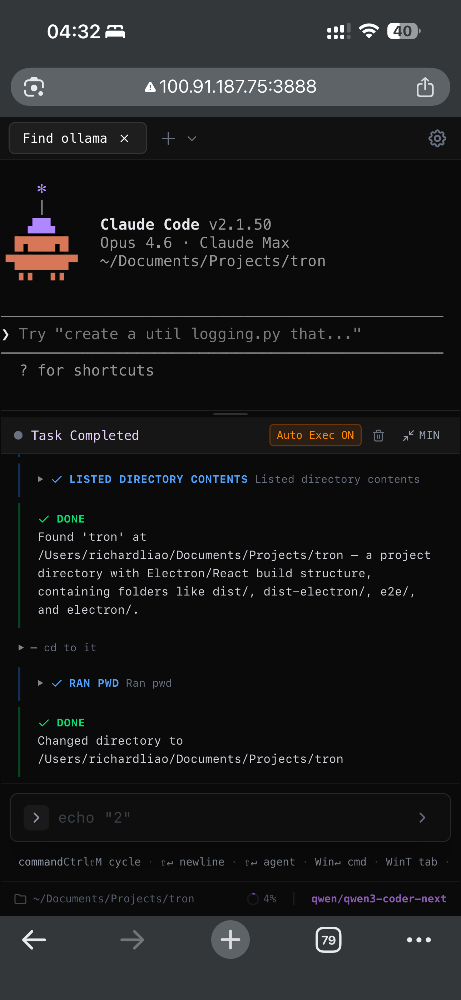

<p align="center">
  
</p>

<h1 align="center">Tron — AI-Powered Terminal</h1>

<p align="center">
  <em>Works on mobile too — access your terminal from anywhere via web mode</em>
</p>
<p align="center">
  
</p>

<p align="center">
  A terminal where the AI operates directly in your shell — running commands, reading output, writing files, and iterating until the job is done.
</p>

<p align="center">
  <a href="https://github.com/Shadowhusky/Tron/stargazers"></a>
  <a href="https://github.com/Shadowhusky/Tron/blob/main/LICENSE"></a>
  <a href="https://discord.gg/EeTCS7A6"></a>
  <a href="https://github.com/Shadowhusky/Tron/releases"></a>
</p>

---

## Why Tron?

Most AI coding tools are chat-first — you paste context in, copy commands out, run them yourself. Tron is **terminal-first**: the AI agent executes multi-step plans directly in your real shell with full visibility and permission controls.

- **Real terminal** — full PTY with xterm.js, your aliases and tools all work
- **AI agent** — describe what you want, the agent executes step-by-step with live output
- **Any model** — Ollama, LM Studio, OpenAI, Anthropic, Gemini, DeepSeek, Kimi, Qwen, GLM, MiniMax, or any compatible API
- **SSH remote** — connect to remote servers; terminal, agent, and file ops work identically over SSH
- **Web mode** — self-host your terminal and access it from anywhere, or deploy as an SSH gateway
- **Cross-platform** — macOS, Windows, Linux. Desktop (Electron) or browser.
- **Safe** — dangerous command detection, permission prompts, loop detection, circuit breakers

## Demo

| Terminal & Split Panes | AI Agent |
|:---:|:---:|
|  |  |

| Input Modes | Advice Mode |
|:---:|:---:|
|  |  |

| Themes | Settings |
|:---:|:---:|
|  |  |

## Getting Started

**Prerequisites:** Node.js 18+. Optionally [Ollama](https://ollama.ai) for free local AI.

```bash
git clone https://github.com/Shadowhusky/Tron.git
cd tron && npm install

# Desktop app
npm run dev

# Web app (self-hosted)
npm run dev:web
```

On first launch, the setup wizard walks you through theme selection and AI provider configuration.

## Deployment Modes

| Mode | Command | Use Case |
|------|---------|----------|
| **Desktop** | `npm run dev` | Local Electron app |
| **Web (local)** | `npm run start:web` | Self-hosted terminal, accessible from any browser |
| **Web (gateway)** | `TRON_MODE=gateway npm run start:web` | SSH-only relay for cloud/hosted deployments |

**Web mode** lets you host your development terminal on a server and access it from anywhere — laptop, tablet, or phone. Gateway mode restricts access to SSH connections only, making it safe for multi-user cloud deployments.

> **Tip:** Local network addresses (e.g. `192.168.x.x`) are not reachable outside your LAN. For easy remote access on mobile, pair web mode with a mesh VPN like [Tailscale](https://tailscale.com) — it assigns a stable IP to each device so you can reach your terminal from anywhere without port forwarding.

## Features

### Terminal
- Tabbed interface with split panes (vertical/horizontal, recursive nesting)
- Smart input bar with shell completions, AI ghost text, and command history
- Three themes — Dark, Light, Modern (frosty glass) + system auto-detect
- Session persistence across restarts

### AI Agent
- Autonomous multi-step execution with live terminal output
- Tools: `execute_command`, `run_in_terminal`, `write_file`, `read_file`, `edit_file`, `send_text`, `read_terminal`
- Permission system with dangerous command detection and double-confirm
- Auto-execute mode, thinking mode, streaming overlay with diff previews
- Context management with usage ring, summarization, and `/log` export

### Input Modes
| Mode | Description |
|------|-------------|
| **Auto** | Detects command vs. natural language |
| **Command** | Direct shell with Tab completion |
| **Advice** | AI suggests a single command with explanation |
| **Agent** | Multi-step autonomous execution |

### SSH
- Password, private key, and SSH agent authentication
- Saved profiles with optional credential persistence
- AI agent works fully over SSH (commands, file ops, system inspection)

### Providers
Ollama, LM Studio, OpenAI, Anthropic, Gemini, DeepSeek, Kimi, Qwen, GLM, MiniMax, OpenAI Compatible, Anthropic Compatible.

## Keyboard Shortcuts

| Action | macOS | Windows/Linux |
|--------|-------|---------------|
| New tab | `Cmd+T` | `Ctrl+T` |
| Close tab | `Cmd+W` | `Ctrl+W` |
| Split vertical | `Cmd+D` | `Ctrl+D` |
| Split horizontal | `Cmd+Shift+D` | `Ctrl+Shift+D` |
| Settings | `Cmd+,` | `Ctrl+,` |
| Force agent | `Cmd+Enter` | `Ctrl+Enter` |
| Cycle mode | `Ctrl+Shift+M` | `Ctrl+Shift+M` |

All shortcuts are customizable in Settings.

## macOS Gatekeeper Notice

When opening the app for the first time on macOS, you may see a warning that the app is from an unidentified developer. To open it:

**Right-click** the app → **Open** → click **Open** in the dialog.

You only need to do this once — macOS remembers your choice. To build a fully signed app that skips this warning, see the [code signing guide](https://www.electron.build/code-signing).

## Development

```bash
npm run dev              # Electron + Vite dev
npm run dev:web          # Web mode dev
npm run build            # Production build
npm run lint             # ESLint
npm run test:e2e         # Playwright E2E tests
```

## Tech Stack

Electron, React 19, TypeScript, Vite, xterm.js, Tailwind CSS, Framer Motion, TanStack Virtual/Query, ssh2, Playwright.

## Community

- [Discord](https://discord.gg/EeTCS7A6) — questions, feedback, feature requests
- [GitHub Issues](https://github.com/Shadowhusky/Tron/issues) — bug reports

## License

MIT
